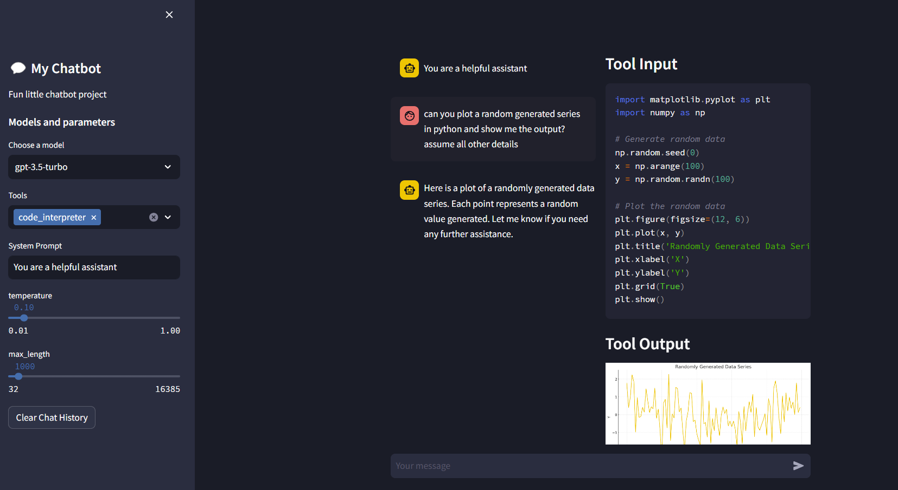
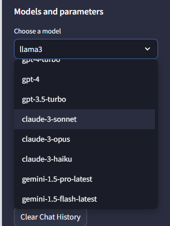

# open-chat
Fun little streamlit based application for chatting with models from different types including:
- Open AI
- Google
- Llama
- Anthropic

## Files
- main.py - streamlit logic
- models.py - model definitions
- agents directory - model templates

## Screenshots
### Chat Snippet

### Model Selection

