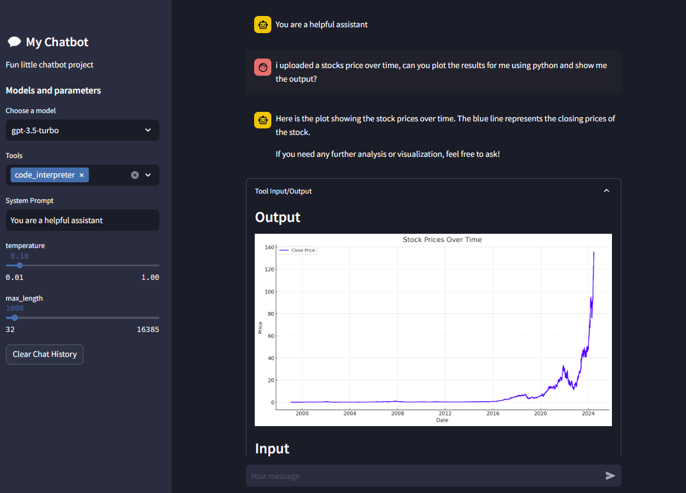
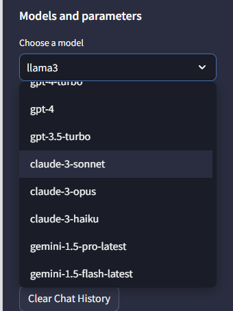
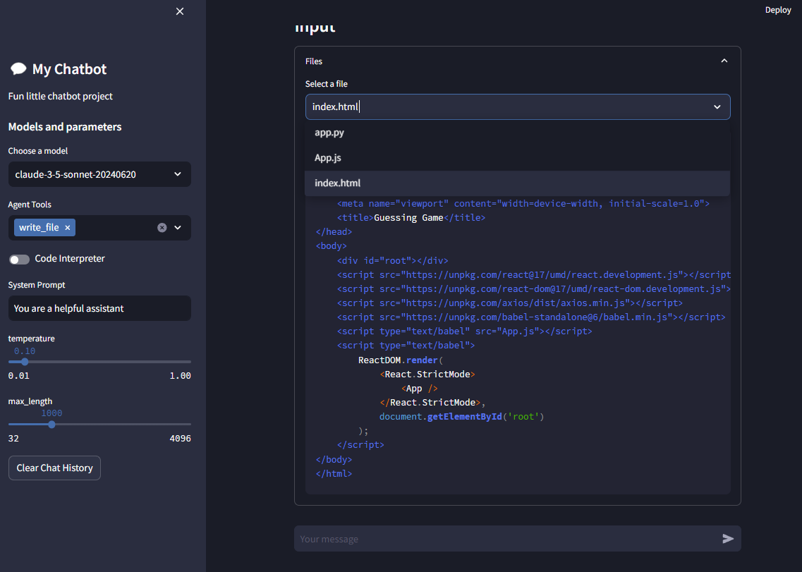
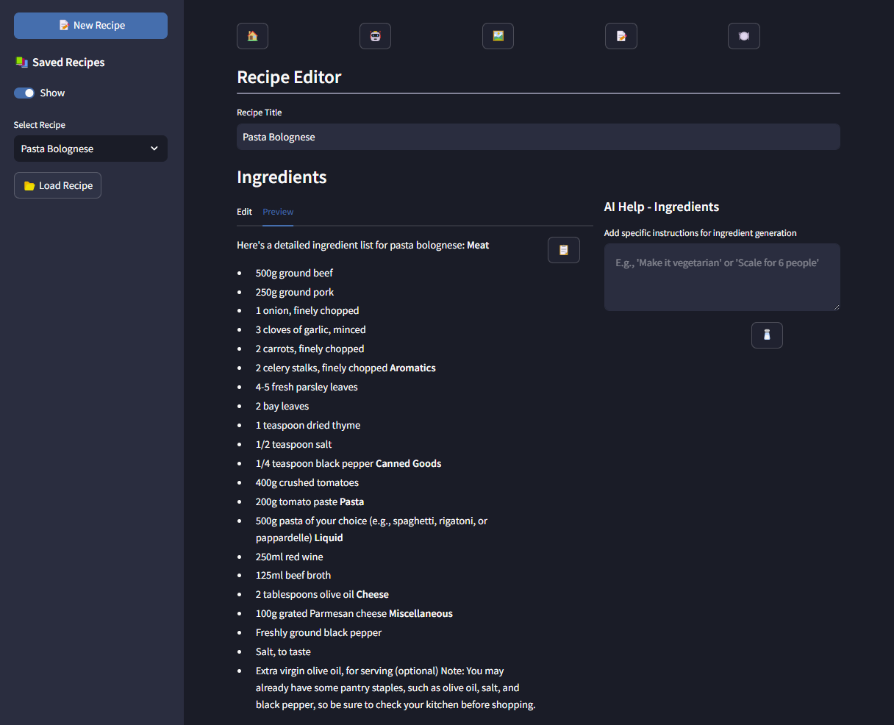
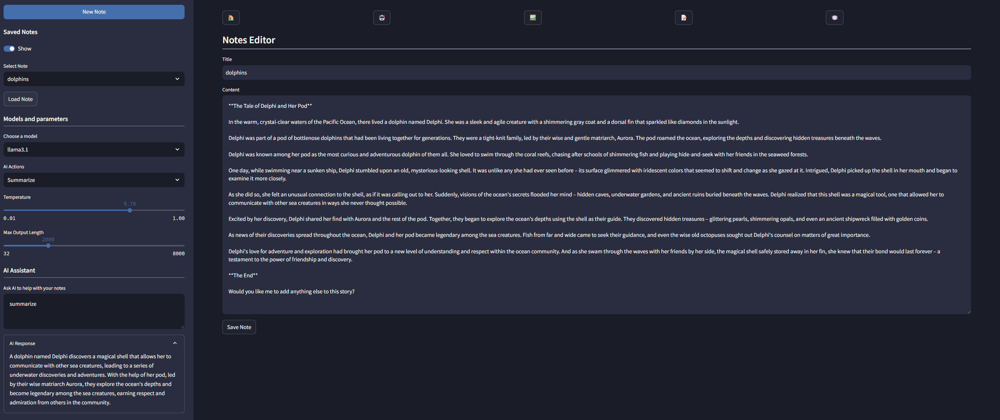

# open-chat
Fun little streamlit based application for chatting with models from different types including:
- Open AI
- Google
- Llama
- Anthropic
- xAI
- Perplexity

## Files
- main.py - streamlit logic
- models.py - model definitions
- agents directory - model templates
- recipes.py - recipe generation
- tools.py - tool definitions
- utils.py - utility functions
- notes.py - note generation

## Screenshots
### Chat Snippet

### Model Selection

### Custom Tool Usage

### Recipe Generation

### Notes

